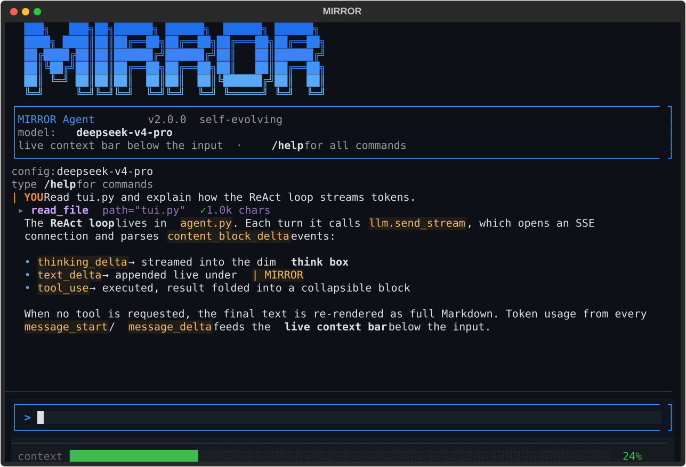

<div align="center">

# MIRROR

**A self-evolving terminal agent that builds its own tools.**

[](https://www.python.org/)
[](LICENSE)
[](https://textual.textualize.io/)

</div>

<div align="center">



</div>

---

MIRROR is an agentic coding & research assistant that runs entirely in your
terminal. It reasons with tools, streams its thinking live, delegates hard
sub-tasks to specialized sub-agents — and, as its defining trick, **writes,
tests, and ships new tools to itself** when no existing tool fits the job.

It speaks the Anthropic Messages API, so it runs on **DeepSeek** out of the box
and any Anthropic-compatible endpoint.

## ✨ Highlights

- **Self-evolution.** Follows a disciplined *assess → build → verify → maintain*
  protocol. When a capability is missing and worth keeping, MIRROR generates a
  new tool with tests, reviews it, and fixes any warnings — then the tool is
  live and callable like any built-in.
- **Hierarchical sub-agents.** Delegate to `researcher`, `planner`, `coder`,
  `critic`, `tool_designer`, or `general` — each with isolated context and a
  shared toolset.
- **Live context meter.** A wide progress bar under the input tracks how full
  your context window is in real time (green → amber → red) and auto-compacts
  when it gets heavy.
- **Claude-style tool calls.** Every tool invocation is a single collapsed row
  (`▸ read_file path="…" ✓ 2.4k chars`); click to expand full arguments and
  results.
- **Streaming thinking.** Watch the reasoning stream into a dim think-box while
  the final answer renders as rich Markdown.
- **Resilient by default.** Automatic retries on `429`/`5xx`, exponential
  backoff, result truncation, and context compaction — long sessions just keep
  going.

## 🚀 Quick start

```bash
git clone https://github.com/JadeWangMirror/FromZero2Agent.git
cd FromZero2Agent
pip install -r requirements.txt
```

Add your API key to a `.env` file (or export it):

```bash
echo "DEEPSEEK_API_KEY=sk-your-key-here" > .env
```

Run:

```bash
python main.py        # TUI mode
python main.py --cli  # plain CLI mode
```

> On Windows you can also double-click `run.bat` — it bootstraps the venv and
> dependencies for you.

## ⌨️ Using it

Type a task, press **Enter** to send. While MIRROR works you'll see its thinking
stream in, tool calls fold in, and the final answer render as Markdown.

| Key | Action |
|---|---|
| `Enter` | send message / accept command |
| `↑` / `↓` | navigate the command palette |
| `Esc` | refocus the input |
| `Ctrl+Q` | quit |

### Slash commands

```
model      /model <name>   switch model           /models    list models + ctx windows
reasoning  /effort <off|low|medium|high>          /temp <n>  /tokens <n>   /system <text|reset>
context    /context        usage + progress bar    /compact   compress history now
                                                   /cost      token usage this session
session    /clear          /init   write MIRROR.md /config [save]   /save [path]   /load <path>
tools      /tools          /stats [all|unused|top]
```

Start typing `/` for an autocomplete palette; commands with no argument run
instantly on `Enter`.

## 🧬 How self-evolution works

MIRROR never jumps straight to building. The mandated decision protocol:

1. **Assess** — `propose_tool(capability, reuse_signal)` returns a `BUILD` or
   `SKIP` verdict, already checking for duplicates.
2. **Respect the verdict** — reuse an existing tool, or fall back to `run_python`
   for one-offs (one-offs must not become tools).
3. **Build** — `create_tool(name, description, parameters, code, test_code)`.
   Every tool ships with a test.
4. **Verify & iterate** — `review_tool(name)` flags issues; fix via `update_tool`
   until clean.
5. **Maintain** — `tool_stats(detail="unused")` finds dead tools to `delete_tool`.

Newly created tools persist to disk and are loaded on the next launch.

## 🏗️ Architecture

```
main.py        entry — TUI or --cli
tui.py         Textual app: conversation, status bar, collapsible tool calls
agent.py       ReAct loop, streaming, history, hierarchical sub-agents, compaction
llm.py         httpx SSE client (Anthropic protocol), retries, usage tracking
tools.py       tool registry + built-ins (run_python, calculate, …)
filetools.py   read / write / list / grep / glob
webtools.py    fetch / search
toolforge.py   self-evolution engine (propose / create / review / improve / delete)
subagents.py   role-specific prompts for delegation
config.py      config.json + env loading
```

## ⚙️ Configuration

`config.json` (auto-created, editable, also settable via env vars):

```json
{
  "model": "deepseek-v4-pro",
  "base_url": "https://api.deepseek.com/anthropic",
  "max_tokens": 4096,
  "temperature": 1.0,
  "max_turns": 10,
  "max_history": 50
}
```

Environment overrides: `DEEPSEEK_MODEL`, `DEEPSEEK_BASE_URL`, `DEEPSEEK_TEMP`,
`DEEPSEEK_MAX_TOKENS`, `DEEPSEEK_MAX_TURNS`, `DEEPSEEK_MAX_HISTORY`.

## 📄 License

Released under the [MIT License](LICENSE).
